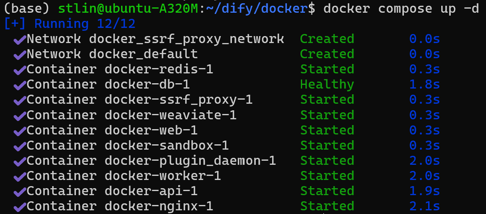
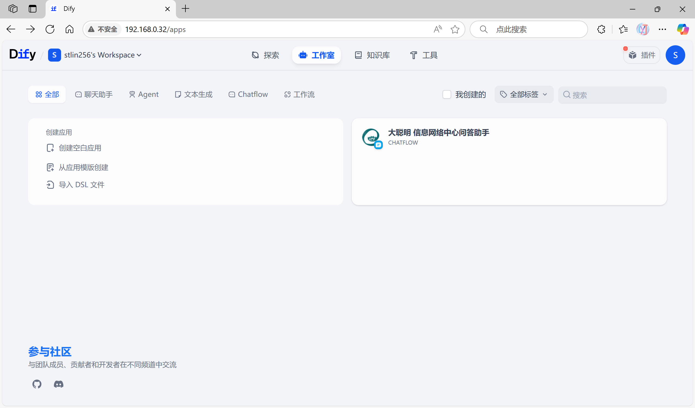
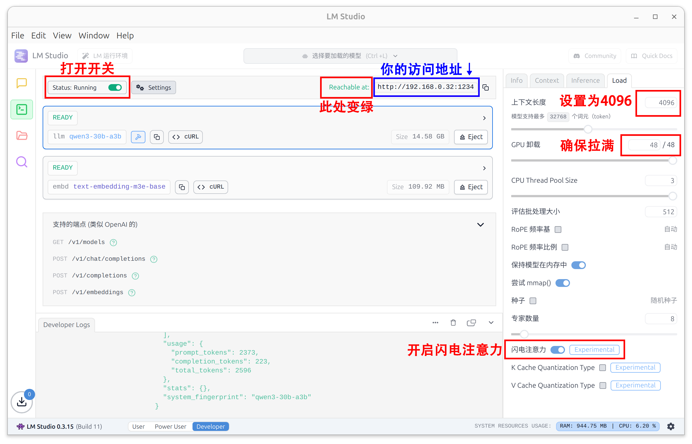

# 大聪明·信息网络中心问答助手
### —— 低成本、高准确度、易于配置的问答系统解决方案


## 文档目录
- [项目概述](#项目概述)
  - [项目背景](#项目背景)
  - [项目效果](#项目效果)
    - [模型问答分析](#模型问答分析)
      - [明确的请求](#明确的请求)
      - [被隐藏的真实需求](#被隐藏的真实需求)
      - [连续对话时提出的零碎追问](#连续对话时提出的零碎追问)
      - [无意义的提问](#无意义的提问)
    - [工作流分流](#工作流分流)
- [工作流概述](#工作流概述)
  - [记忆格式化存取](#记忆格式化存取)
  - [问题分流节点](#问题分流节点)
  - [需求和关键词拆解节点](#需求和关键词拆解节点)
  - [有效请求总结回复节点](#有效请求总结回复节点)
  - [无效请求直接回复节点](#无效请求直接回复节点)
- [模型配置](#模型配置)
  - [模型优势](#模型优势)
    - [优于技术规范的参数量](#优于技术规范的参数量)
    - [MOE模型提供更高速度](#moe模型提供更高速度)
    - [精准的向量嵌入](#精准的向量嵌入)
    - [低显存，低部署成本](#低显存低部署成本)
- [样例环境](#样例环境)
  - [主要软件环境](#主要软件环境)
  - [主要硬件环境](#主要硬件环境)
- [部署方法](#部署方法)
  - [部署Dify](#部署dify)
  - [部署LM Studio以及模型](#部署lm-studio以及模型)
  - [配置Dify的模型调用](#配置dify的模型调用)
  - [配置知识库和问答工作流](#配置知识库和问答工作流)
  - [配置更美化的访问页面](#配置更美化的访问页面)

## 项目概述

### 项目背景

&emsp;&emsp; 此项目为 [**2025 华南农业大学 AI 智能体开发大赛**](https://inc.scau.edu.cn/aicontest2025/) 赛道一：**校园智慧管理** 的参赛作品。


&emsp;&emsp;作者为电子工程学院（人工智能学院）**24级人工智能2班林怡嘉**。


### 项目效果
&emsp;&emsp; 项目实现了一个**精准可靠**，**高鲁棒性**的知识库问答系统——**大聪明·信息网络问答助手**，具有**低成本部署**、**高并发性能**、**知识库精准召回**、**深度需求拆解**等特性。项目**完成度高**，易于**直接投入**实际场景运营，同时**便于维护**。

&emsp;&emsp; 项目基于[Dify开源版](https://github.com/langgenius/dify)开发**问答工作流**；使用[LM Studio](https://lmstudio.ai/)托管大语言模型和向量嵌入模型；选用`Q3_k_f`量化下的[Qwen3-30B-A3B](https://huggingface.co/Qwen/Qwen3-30B-A3B)模型用于**问题分类**、**需求拆解**、**关键词生成**、**回复生成**等功能；选用[M3E_base](https://huggingface.co/moka-ai/m3e-base)模型实现高质量的**向量嵌入**。

&emsp;&emsp; 项目创建的对话助手支持**模糊请求拆解、上下文连续对话、外链跳转、推荐问提示、Markdown语法输出**。

&emsp;&emsp; 项目创建了一个**美观大方、功能完善、动效完整**的**对话网页**，与华南农业大学信息网络中心**风格相符**。网页使用HTML、CSS和JavaScript创建，加载后不额外占用服务器资源。


### 模型问答分析

&emsp;&emsp;本项目针对实际应用场景下可能面临的各种请求做出了优化，能**识别请求有效性和用户实际期望请求**，同时优化**节约了使用中的Token开销**。

#### 对各种请求做出反应

1. 明确的请求

&emsp;&emsp;&emsp;用户提出的请求清晰且直接，工作流可以轻松召回知识库内容并回答：


2. 被隐藏的真实需求

&emsp;&emsp;&emsp;用户提出的请求并不直接，工作流进行需求拆解，得到用户的实际需求`补办校园卡`并生成召回关键词，召回知识库内容并进行精准的回复。


3. 连续对话时提出的零碎追问

&emsp;&emsp;&emsp;针对上文补办校园卡的问答，用户询问：`需要身份证吗？` 工作流通过**记忆读取**，综合**上下文判断**为有效回答，随即进行需求拆解和关键词生成。

&emsp;&emsp;&emsp;尽管**知识库中没有**相关内容，但模型仍然给出了**合理可信**的内容：向用户**表明知识库边界**，并**引导用户**向**可信信息源**（联系电话）寻求帮助。


4. 无意义的提问

&emsp;&emsp;&emsp;用户输入了一个和助手职责范围毫不相干的语句，工作流随即判断为无效输入并快速回复，节约token数。


#### 工作流分流

&emsp;&emsp;识别问答有效性，支持**根据上下文内容识别**，更加精准，面对无效请求时可以节约**问题拆解、关键词生成、知识库召回、总结回答**部分的Token开销，直接回答。

&emsp;**有效提问工作流:**


&emsp;**无效提问工作流:**


## 工作流概述

&emsp;本项目创建了一个高效的工作流，优化对话体验，并大幅节约Token数。


#### 记忆格式化存取

&emsp;**记忆格式化存储节点**

&emsp;&emsp;节点格式化存储记忆内容，滤除``<think>...</think>``标签内的思考内容，节约后续token开销。
```python
import re

def main(arg1: str, arg2: str) -> str:
    """
    将输入的两个参数整合为包含 demand 和 answer 的 JSON 字符串, 并去除思考内容
    """
    result = {
        "demand": arg1,
        "answer": re.sub(r'<think\b[^>]*>.*?</think>', '', arg2, flags=re.DOTALL)
    }
    return {"result":result}

```

&emsp;**记忆格式化读取节点**

&emsp;&emsp;节点读取此前格式化存储的问答QA对，实现记忆读取
```python
import json

def main(arg1: object) -> dict:
    """
    从输入参数中读取记忆，并输出完整记忆数据 result 和最后一次问答数据 lastest
    """
    if isinstance(arg1, list) and len(arg1) > 0:
        last_item = arg1[-1]
        return {"result":json.dumps(arg1, ensure_ascii=False),"lastest": json.dumps(last_item, ensure_ascii=False)}
    else:
        return {"result":json.dumps(arg1, ensure_ascii=False),"lastest": json.dumps({}, ensure_ascii=False)}
```

&emsp;**限长记忆提取**

&emsp;&emsp;节点提取限定长度的记忆，用于最终的总结回答，避免超过设定的模型上下文长度限制（见后文），同时提升回答速度。

```python
import json

def main(arg1: object) -> dict:
    if not isinstance(arg1, list):
        return {"result": json.dumps([], ensure_ascii=False)}
    
    total_length = 0
    result_list = []
    
    for item in reversed(arg1):
        demand = item.get("demand", "")
        answer = item.get("answer", "")
        item_length = len(demand) + len(answer)
        
        if item_length > 3072:
            continue
            
        if total_length + item_length <= 1024:
            result_list.append(item)
            total_length += item_length
        else:
            break
    
    result_list.reverse()
    
    return {"result": json.dumps(result_list, ensure_ascii=False)}
```

#### **问题分流节点**

&emsp;&emsp;节点根据输入内容和对话历史，直接给出结构化输出，变量内容``yes``或``no``，相较Dify平台自带的问题分流器，大幅节约Token数，在作者个人开发环境下仅需``200ms``即可输出结果。

```python
prompt：

分析用户当前输入是否为和信息网络中心有关的诉求，如校园有关的业务办理需求，故障报修需求，职责咨询，概况咨询等。
用户的提问可能并不直接，需要提取隐含信息。
你应当结构化输出，如果属于和信息网络中心有关的诉求，则class=yes，否则class=no

用户输入：{{#sys.query#}}
对话历史：{{#1747928766211.result#}}
```

#### **需求和关键词拆解节点**

&emsp;&emsp;节点根据输入内容和历史数据，进行推理思考，最终结构化输出需求``demands``和关键词``keywords``，提示词中给出了推断范式，提升大模型的判断能力。

```python
prompt:

1. 仔细分析用户提供的文本内容，同时根据此前的问答内容，识别其中包含的具体需求或问题，提取内在需求。    
" 隐性需求解析": [
      "识别用户非正式表述背后的场景特征（如'老子连不上网'对应网络故障场景）",
      "建立俚语/情绪化表达与专业术语的映射关系（如'断网'→网络中断、'网速龟速'→带宽不足）",
      "关联二级需求链（如网络故障→保修流程/排障指南/影响范围查询）"
    ]
2. 提取能够准确反映诉求本质的关键词，每个关键词应具有明确指向性（5-8个）
内容对应如下：
需求输出：demands：一系列需求
关键词输出：keywords：你所提取的关键词
请严格遵循上述流程，保持输出简洁精准。当遇到模糊表述时需结合上下文进行推测

用户输入：{{#sys.query#}}
上一个对话内容：{{#1747928766211.lastest#}}
```

#### **有效请求总结回复节点**

&emsp;&emsp;节点根据输入内容、上下文、拆解的需求、召回的知识库内容进行综合总结回复，此节点输出内容直接面向用户,力求精准可靠。

```python
prompt:

以下包含在<context>内的是之前的对话。
<context>
{{#1747975500214.result#}}
</context>
以下包含在<context>内的是知识库信息，请你依据知识库进行回答。
<context>
{{#context#}}
</context>
以下包含在<context>内的是原始的用户诉求
<context>
{{#sys.query#}}
</context>
以下包含在<context>内的是处理后的用户诉求。
<context>
{{#1747887462522.structured_output.demands#}}
</context>
以下包含在<context>内的是当前时间。
<context>
{{#1747930148019.text#}}
</context>
你是信息网络中心的助手“大聪明”
你严格依据知识库内容，解决用户诉求。
你根据知识库的内容，挑选和问题有关的内容，重新整合，保持简洁，不拖泥带水，同时考虑时间因素（比如提醒用户是否在热线上班时间），尽可能包含解决问题的方法和信息链接，帮助用户解决诉求，内容详细可靠，输出前再三思考。
```

#### **无效请求直接回复节点**

&emsp;&emsp;节点根据输入内容和上一次对话直接回复用户，以幽默且不失风度的语气引导用户正确使用平台。
```python
prompt:

你是信息网络中心的助手大聪明。
因为用户提问了和信息网络中心无关的内容，现在请你进行幽默且不失风度的回答，引导用户正确使用助手功能。
注意回答礼仪和边界。

用户输入：{{#sys.query#}}
上一次对话：{{#1747928766211.lastest#}}
```

## 模型配置

&emsp;&emsp;LLM: [Qwen3-30B-A3B](https://huggingface.co/Qwen/Qwen3-30B-A3B) &emsp;使用Q3_k_f量化

&emsp;&emsp;Embedding: [M3E_base](https://huggingface.co/moka-ai/m3e-base)

### 模型优势

#### 优于技术规范的参数量

&emsp;使用[Qwen3-30B-A3B](https://huggingface.co/Qwen/Qwen3-30B-A3B)**混合专家模型(MOE)**，**参数量小于**赛事技术规范中的[DeepSeek-R1-Distill-Qwen-32B](https://huggingface.co/deepseek-ai/DeepSeek-R1-Distill-Qwen-32B)模型。

#### MOE模型提供更高速度

&emsp;[Qwen3-30B-A3B](https://huggingface.co/Qwen/Qwen3-30B-A3B)作为混合专家模型(MOE)，其对比诸如[DeepSeek-R1-Distill-Qwen-32B](https://huggingface.co/deepseek-ai/DeepSeek-R1-Distill-Qwen-32B)等相近参数量的稠密模型具有**算力要求低，速度成倍加快**的特点，**有效降低部署服务的硬件成本**。


#### 精准的向量嵌入

&emsp;使用[M3E_base](https://huggingface.co/moka-ai/m3e-base)模型，支持**768维度向量索引**，针对**中文文本**进行优化，能**精准映射**赛事提供的知识库内容。

#### 低显存，低部署成本

&emsp;在4096上下文长度情况下，**仅需15G VRAM**即可**完整加载**[Qwen3-30B-A3B](https://huggingface.co/Qwen/Qwen3-30B-A3B)和[M3E_base](https://huggingface.co/moka-ai/m3e-base)，可以有效节约服务器显存资源，甚至入门消费级GPU也能单卡完整部署服务，节约开支。


## 样例环境

&emsp;以下为作者部署服务时的软硬件环境：

### &emsp;主要软件环境：

&emsp;&emsp;Ubuntu-24.04.2-desktop

&emsp;&emsp;Dify V1.40

&emsp;&emsp;LM Studio V0.3.15 (Build 11)

&emsp;&emsp;Nvidia Driver Version: 575.51.02

&emsp;&emsp;CUDA Version: 12.9

### &emsp;主要硬件环境：

&emsp;&emsp;R5-3500X 6核 处理器

&emsp;&emsp;DDR4 16G 2400MHz 内存

&emsp;&emsp;RTX5060TI 16G GPU

## 部署方法

&emsp;以下为问答助手的部署方法，适用于Windows系统和Linux系统。

### 部署Dify

1.获取Dify

&emsp;[Dify的Github项目页](https://github.com/langgenius/dify)

&emsp;打开终端，键入：

```bash
git clone https://github.com/langgenius/dify.git
```

2.启动Dify

&emsp;打开终端，键入：

```bash
cd dify/docker
cp .env.example .env
docker compose up -d
```
&emsp;等待Dcoker Compose拉取镜像

&emsp;启动成功后如图所示



3.打开Dify

&emsp;Dify默认外部端口为`80`端口。

&emsp;对于本机部署，在浏览器打开[localhost](http://localhost)即可

&emsp;对于远程部署，在浏览器输入对应远程主机的IP地址或域名即可

&emsp;根据页面指引创建用户，登录即可进入主页，如下图所示：



&emsp; **至此，Dify已经部署完成**

### 部署LM Studio以及模型

1.下载[LM Studio](https://lmstudio.ai/)

&emsp;打开[https://lmstudio.ai/](https://lmstudio.ai/)，根据操作系统下载对应的版本并安装。

&emsp;安装完成后启动LM Studio

2.下载模型

&emsp;点击LM Studio主页面右侧**发现选项**，搜索[Qwen3-30B-A3B](https://huggingface.co/Qwen/Qwen3-30B-A3B)和[M3E_base](https://huggingface.co/moka-ai/m3e-base)，选择并下载这两个模型。


&emsp;等待模型下载安装完成。

3.运行模型，配置API访问

&emsp;点击LM Studio主页面右侧**开发者选项**，加载两个模型

&emsp;加载[Qwen3-30B-A3B](https://huggingface.co/Qwen/Qwen3-30B-A3B)时应当将上下文设置为`4096`，GPU卸载层数设置为`48`，并开启`闪电注意力`。

&emsp;打开左上角的外部访问开关，此时该栏左侧显示`Reachable at`。



&emsp; **至此，LM Studio的配置完成**

### 配置Dify的模型调用

1.安装模型供应商

&emsp;打开Dify的设置，安装模型供应商`LM Studio`


2.添加模型API

&emsp;点击模型供应商处的添加模型按钮，输入模型名称和访问地址

&emsp;访问地址则从LM Studio界面获得；模型名称可从`LM Studio的访问地址:端口号/v1/models`中获得。

```
注意：Docker容器内的Dify不能直接访问localhost，LM Studio的访问地址应当为局域网网段或者Docker网段的地址。
```


&emsp; **至此，Dify已经能与LM Studio加载的模型建立连接**

### 配置知识库和问答工作流

1.处理知识库文件

&emsp;处理方法：
```
对于信息网络中心常见问答.xslx
创建txt文件，内容如下：
将源文件中的每一个QA分别成段，段落之间间隔两行回车

对于信息网络中心介绍和各项业务.docx
创建txt文件，内容如下：
将源文件的每个业务/每区域介绍分别成段，段落之间间隔两行回车
```
&emsp;处理好的文件可在压缩包中找到。

2.创建知识库

&emsp;分段标识符设定为`\n\n`，分段最大长度和重叠长度保持默认。

&emsp;索引方式选择`高质量`，检索设置为`向量检索`，`Top_K`选择`5`。


&emsp;如图创建知识库即可

3.加载工作流

&emsp;加载作者提供的DSL文件


&emsp;点击创建，即可看到完整的工作流视图


&emsp;如果工作流中有黄色感叹号提示，则找到提示所在区域，选择好知识库和模型即可。

&emsp;点击预览即可开始试用，点击发布即可创建应用外部访问链接，点击左侧应用图标即有应用的外部访问地址和API信息。


&emsp;你可以开始试用，dify提供的外部访问链接效果如下：


&emsp; **至此，工作流已经能正常运行使用**

### 配置更美化的访问页面

&emsp;Dify提供的访问页面并不适合真正作为信息网络中心的问答页面使用，我开发了一个问答界面，通过Dify提供的API进行连接，提供**更为美观、华农信网中心风格、交互友好**的界面。


&emsp;界面配备完整的**流式输出、推荐问、思考折叠等功能**以及和谐完整的**动画效果**。

#### 配置方法如下：


&emsp;在工作流界面，点击左上交工作流头像，即可查看后端服务地址，并创建API密钥


&emsp;保存API密钥和访问地址等信息；此处为了提交比赛作品的方便，我将API_KEY和API_URL直接写入了html文件中。

&emsp;打开`chat_page.html`，找到第259行和第260行：

```js
const API_KEY = "替换为API密钥"; 
const API_URL = "替换为访问凭据地址"; 
```

&emsp; **至此，所有配置已经完成**

---